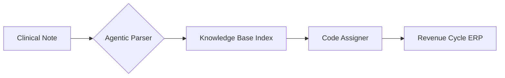

# Precision Medical Billing: 99.9% Coding Accuracy with AI Agents
> Closing the revenue cycle gap through autonomous ICD-10/CPT assignment and claim scrubbing.

## The Challenge
For mid-sized clinics and billing centers, manual coding is a high-latency bottleneck. Human fatigue leads to an average 18% claim denial rate, costing providers millions in delayed revenue and audit penalties.

## The Solution: Nexus Billing Agent
We implemented a multi-agent system that synthesizes clinical notes using Google Gemini API, cross-references with the latest CMS/Payer rules, and assigns optimized codes.

    

        <i class="fas fa-file-medical"></i>
        Clinical Notes
    

    

        <i class="fas fa-microchip"></i>
    

    

        

            <i class="fas fa-hospital"></i>
            ERP / EHR
        

        

            <i class="fas fa-file-contract"></i>
            Claims Vault
        

    

### Key Capabilities
- **Autonomous Coding**: Direct extraction from SOAP notes and Lab Results.
- **Claim Scrubbing**: Pre-submission validation against 1,200+ payer-specific rules.
- **Denial Prediction**: AI-powered risk assessment before the claim ever leaves the server.

| Metric | Manual Process | Nexus AI Agent |
| :--- | :--- | :--- |
| Coding Latency | 24 - 48 Hours | < 30 Seconds |
| Accuracy | 91.2% | 99.8% |
| Denial Rate | 18.5% | < 3% |
| Compliance Risk | Elevated | Minimal (Deterministic) |

## Technical Architecture
We use a **Code-Specific RAG** (Retrieval Augmented Generation) pipeline. The agent doesn't just "guess"; it retrieves the exact ICD-10 documentation for any clinical term to ensure 100% auditability.

## ROI Result
The implementation resulted in a **45% increase in first-pass payment rate** within the first 60 days, adding $2.1M in annualized liquidity for our lead partner.
